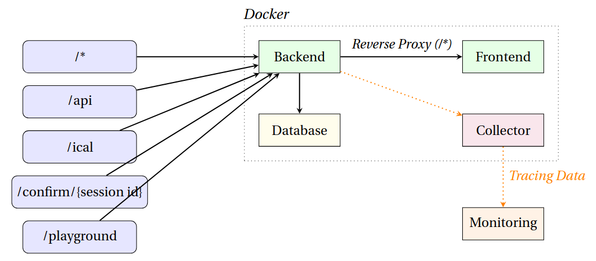

1. Einleitung
    - Anforderungsanalyse
2. Architektur
    - Überblick
    - Technologien und Tools
3. Entwicklungsprozess
    - Projektstruktur
    - Versionierung und Contribution Guideline
    - CI/CD Pipelines
4. Funktionen und Features
    - Hauptfunktionen
    - Benutzerfreundlichkeit bzw. UX/UI
    - Sicherheit: Backend-Kommunikation (mTLS), Passwörter
    - Performance-Optimierungen
5. Herausforderung und Lösungen
6. Deployment
    - Docker
    - Monitoring und Logging
7. Weiterentwicklung und Ausblick
8. Fazit
    - Projektreflexion
    - Erfolgreiche Aspekte
    - Verbesserungspotenzial

# 1. Einleitung

Die Software zur Verwaltung des Vorkurses für Erstsemester soll eine effiziente und übersichtliche Lösung für die organisatorischen Herausforderungen bieten, die jedes Jahr bei der Planung und Durchführung dieser Kurse auftreten. Sie soll die zentrale Verwaltung aller benötigten Ressourcen und Prozesse unterstützen.

Die Arbeit an *pepp* ist enstanden, da sich die Verwaltung jährlicher Vorkurse mit insgesamt rund 400 Teilnehmern als mühsamer, aber automatisierbarer Prozess herausgestellt hat. Der Fokus liegt also insbesondere darauf, wiederkehrende Veranstaltungen unkompliziert zu reproduzieren, um den organisatorischen Aufwand zu minimieren. Im besten Fall trägt das mindestens zur Qualitätssicherung bei; im Optimalfall, dass mehr Wert auf die inhaltliche Planung gesetzt werden kann.

Im Folgenden werden die Anforderungen an die Software detailliert beschrieben.

## 1.1 Anforderungsanalyse

### 1.1.1 Veranstaltungsplanung: Vorlesungen und Tutorien

Die Software muss es den Organisatoren ermöglichen, den Vorkurs in verschiedene Veranstaltungsarten zu unterteilen, z. B. Vorlesungen und Tutorien. Hierbei sollten folgende Funktionen erfüllt werden:

- **Erstellen** von Veranstaltungen: Möglichkeit zur Erstellung und Verwaltung von Vorlesungen und Tutorien mit Angaben zu Titel, Beschreibung, Dozent/Tutor, Terminen und zugehörigen Räumen.
- Festlegung von **Zeitplänen**: Unterstützung bei der Planung von Veranstaltungen, sodass keine Überschneidungen auftreten. Die Software sollte Konflikte erkennen und vermeiden.
- **Flexible Anpassungen**: Die Veranstaltungen müssen während der Planungsphase sowie während des laufenden Vorkurses angepasst oder aktualisiert werden können.

### 1.1.2 Raumverwaltung

Für eine reibungslose Durchführung des Vorkurses ist eine zentrale Raumverwaltung notwendig. Die Software muss dabei folgende Anforderungen erfüllen:

- **Markieren** reservierter Räume: Zuweisung von Räumen zu einzelnen Veranstaltungen unter Berücksichtigung der Raumkapazität
- **Konfliktprüfung**: Die Software soll sicherstellen, dass keine Doppelbuchungen für Räume entstehen und dass die Raumkapazitäten den Teilnehmerzahlen entsprechen.

### 1.1.3 Verwaltung von Tutoren und Dozenten

Die Software sollte ein umfassendes Management für Tutoren und Dozenten bieten, um Verfügbarkeiten und Zuweisungen zu verwalten. Zu den Anforderungen gehören:

- **Verfügbarkeitsmanagement**: Tutoren und Dozenten sollten ihre Verfügbarkeiten direkt in der Software angeben können, damit ihre Zuweisungen entsprechend geplant werden können.
- **Zuweisung** zu Veranstaltungen: Die Software muss die Möglichkeit bieten, Tutoren und Dozenten bestimmten Veranstaltungen (z. B. Tutorien oder Vorlesungen) zuzuweisen und ihnen Benachrichtigungen zukommen zu lassen.
- Verwaltung der **Rollen und Rechte**: Abgrenzung der Rechte zwischen Tutoren, Dozenten und Administratoren, sodass beispielsweise nur die zuständigen Personen Änderungen an den Veranstaltungsdetails vornehmen können.

### 1.1.4 Anmeldesystem für Studenten

Ein zentrales Feature der Software ist die Verwaltung der Anmeldungen. Hierbei wird unterschieden zwischen der Anmeldung für den gesamten Vorkurs und der Auswahl spezifischer Tutorien.

- **Unabhängige** Anmeldung: Häufig werden zur Verwendung universäter Dienste interne Anmeldedaten benötigt, welche einigen Studenten noch nicht zur Verfügung stehen. Ein unabhängiges Registrierungsverfahren soll hier Abhilfe schaffen.
- Anmeldung **für den Vorkurs**: Die Software soll es ermöglichen eine zentrale Anmeldemöglichkeit für kapazitätsbegrenzte Vorkurse anzubieten. Dabei sollen durch einen Fragebogen bevorzugt Studenten mit weniger Vorerfahrung zugelassen werden.
- Anmeldung **zu Tutorien**: Flexible Eintragung anhand der Verfügbarkeit von Plätzen.
- **Bestätigungs- und Erinnerungsmails**: Die Software sollte automatisierte Bestätigungs- und Erinnerungsemails für Anmeldungen versenden, um die Teilnehmer regelmäßig zu informieren.

### 1.1.5 Benutzerfreundlichkeit und Datensicherheit

- **Intuitive** Benutzeroberfläche: Die Software muss eine benutzerfreundliche Oberfläche bieten, die für alle Beteiligten (Administratoren, Dozenten, Tutoren, Studenten) einfach zu bedienen ist.
- **Datenschutz und Sicherheit**: Die Software muss datenschutzkonform sein und den Schutz personenbezogener Daten gewährleisten. Dies beinhaltet eine sichere Anmeldung und verschlüsselte Datenspeicherung. Darüber hinaus die Löschung studentischer Accounts nach Abschluss des Vorkurses.
- **Mobiler Zugriff**: Idealerweise sollte die Software auch auf mobilen Geräten zugänglich sein

# 2. Architektur

## 2.1 Überblick


Die Architektur ist so gestaltet, dass das Backend die zentrale Rolle einnimmt und alle Anfragen verarbeitet. Durch das direkte Reverse Proxying von `/*`-Anfragen an das Frontend wird der Bedarf an einer dedizierten Proxy-Komponente wie *NGINX* umgangen. Somit wird die Komplexität reduziert und Ressourcenbedarf minimiert. Sowohl Backend als auch Frontend senden sog. *Tracing-Daten* an einen internen Collector. Dabei handelt es sich um mit Zeitstempel versehene Logs, welche die Ausführungszeit einzelner Aktionen dokumentiert. Der Collector sammelt diese und schickt sie an einen externen Monitoring-Service wie *Grafana* zur Visualisierung.

## 2.2 Technologien und Tools

### 2.2.1 Frontend: Next.js
Next.js bietet serverseitiges Rendering und statische Seiten-Generierung, was zu schneller Ladezeit und besserer SEO führt, ideal für Webanwendungen, die dynamische und gleichzeitig gut indexierte Inhalte benötigen. Die integrierte Routing-Funktion erleichtern die Entwicklung und sorgen für eine performante, einfach wartbare Codebasis.

#### 2.2.1.1 Ordnerstruktur
```bash
frontend
├── app # Alle Unterordner (ausg. (*)) sind Routing-Einheiten
│   ├── (form-tutor)
│   │   └── form-tutor # Formular zur Eintragung von Verfügbarkeiten für Tutorien
│   ├── (planner) # In der Wurzel der Landingpage Studenplan mit weiteren Administrationsmöglichkeiten
│   │   ├── applications
│   │   ├── events
│   │   ├── overview
│   │   ├── settings
│   │   └── tutorials
│   └── (registration)
│       └── register
├── assets # Statische Ressourcen
│   └── fonts
├── components # Wiederverwendbare UI-Komponenten
│   └── ui # shadcn Komponenten (https://ui.shadcn.com/)
├── config # Konfigurationsdateien
├── lib # Hilfsfunktionen
│   ├── context
│   └── gql
│       ├── generated # Generierte Objekte (Mutations/Queries) von GraphQL
│       ├── mutations
│       └── queries
├── public # Statische öffentliche Dateien
├── styles # Stile und CSS-Dateien
└── types # Typen für TypeScript-Objekte
```

### 2.2.2 Backend: GraphQL (gqlgen)
GraphQL ermöglicht es, genau die Daten abzufragen, die für die jeweilige Ansicht benötigt werden, was die Netzwerkbelastung reduziert und die Client-Performance steigert. Mit gqlgen in Go kann man ein performantes Backend entwickeln, das typsicher, leicht und skalierbar ist.

#### 2.2.2.1 ER-Diagram


#### 2.2.2.2 Ordnerstruktur
```bash
server
├── db # Initialisierung von Postgres
├── email # Handling des E-Mail-Verkehrs
├── graph # GraphQL Objektdefinitionen- und Implementierungen
│   └── model
├── ical # Generierung des ICS-Kalenders
├── maintenance # Regelmäßige Jobs, um Datenbank aufzuräumen
├── models # Datenbankrelationen
├── password # Hashfunktionen
└── tracing # OpenTelemetry-Anbindung
```

### 2.2.3 PostgreSQL
PostgreSQL ist ein leistungsstarkes und SQL-konformes relationales Datenbanksystem mit Unterstützung für erweiterte Funktionen wie JSON-Speicherung und Volltextsuche, was Flexibilität bei der Datenmodellierung ermöglicht.

# 3. Entwicklungsprozess

# 4. Funktionen und Features

## 4.1 Hauptfunktionen

## 4.2 UX/UI

## 4.3 Sicherheit

# 5. Herausforderungen und Lösungen

# 6. Deployment
1. Umgebungsvariablen angeben in `.env.local`
    ```bash
    cp .env .env.local
    ```
    Das Backend verschickt E-Mails. Dafür wird ein `SMTP-Server` benötigt, z.B.:
    ```bash
    SMTP_HOST=smtp.example.de
    SMTP_USER=example@example.de
    SMTP_PASSWORD=1234
    SMTP_PORT=465
    FROM_ADDRESS=vorkurs@example.de
    ```
2. OpenTelemetry-Collector-Konfiguration `otel-collector-config.yaml` anpassen ([mehr Infos](https://opentelemetry.io/docs/collector/configuration/#basics))
3. Docker-Image bauen: `docker compose build`
4. Starten: `docker compose up -d && docker compose logs -f`

# 7. Weiterentwicklung und Ausblick
- Wartelistenmanagement: Automatische Verwaltung von Wartelisten für überbuchte Tutorien und Benachrichtigung von Studenten, wenn Plätze frei werden.

# 8. Fazit
