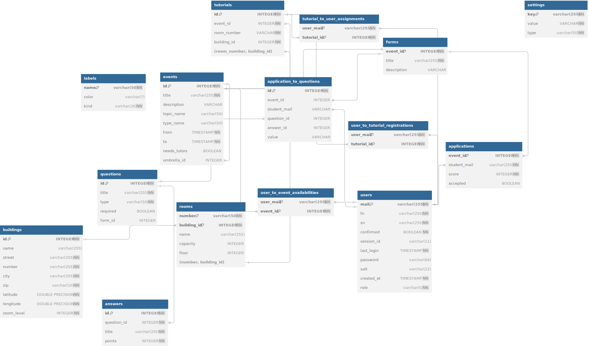

# Welcome to the backend.

## api
See the [documentation](https://fachschaftmathphysinfo.github.io/pepp).

## database er-diagram


## migrations

To run migrations:

```shell
BUNDEBUG=2 go run ./cli db migrate
```

To rollback migrations:

```shell
go run ./cli db rollback
```

To view status of migrations:

```shell
go run ./cli db status
```

To create a migration:

```shell
go run ./cli db create migration_name
```

To get help:

```shell
go run ./cli db

NAME:
   pepp db - database migrations

USAGE:
   pepp db [command options]

COMMANDS:
   init          create migration tables
   migrate       migrate database
   rollback      rollback the last migration group
   lock          lock migrations
   unlock        unlock migrations
   create        create migration
   status        print migrations status
   mark_applied  mark migrations as applied without actually running them
   help, h       Shows a list of commands or help for one command

OPTIONS:
   --help, -h  show help
```

See [docs](https://bun.uptrace.dev/guide/migrations.html) for details.
